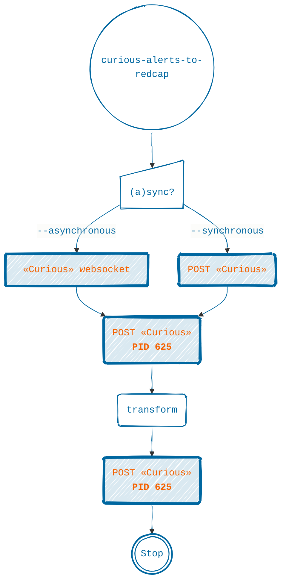

# from Curiuos

## alerts to REDCap

```mermaid
---
config:
  look: handDrawn
  themeVariables:
    edgeLabelBackground: '#FAF9F500'
    fontFamily: "Verdana, Courier New, Arial Black, Arial Bold, cursive, fantasy"
---
flowchart TD
    classDef apiCall color:#F56200,fill:#0067a025,stroke:#0067a0,stroke-width:4px;
    classDef default stroke:#0067a0,color:#0067a0,fill:#FAF9F510;

    start@{ shape: circle, label: "curious-alerts-to-redcap" } --> sync@{ shape: manual-input, label: "(a)sync?"} --"--asynchronous"--> websocket@{ shape: rectangle, label: "«Curious» websocket" } --> _fetch_alerts_metadata --> transform@{ shape: rounded, label: "transform" } --> push_to_redcap@{ shape: rounded, label: "POST «Curious»\n**PID 625**" } --> stop@{ shape: dbl-circ, label: "Stop" };;

    sync --"--synchronous"--> fetch_alerts@{ shape: rounded, label: "POST «Curious»" } --> _fetch_alerts_metadata@{ shape: rounded, label: "POST «Curious»\n**PID 625**" };

    class fetch_alerts,_fetch_alerts_metadata,push_to_redcap,websocket apiCall;
    linkStyle 0,1,2,3,4,5,6,7 stroke:#0067a0,color:#0067a0
```
