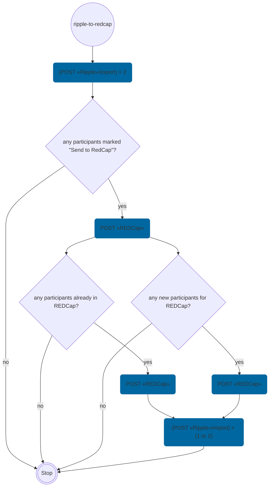

# from Ripple

## to REDCap

```mermaid

flowchart TD
    classDef apiCall fill:#0067a0,stroke:#0067a0,stroke-width:4px;

    start@{ shape: circle, label: "ripple-to-redcap" } --> request_potential_participants@{ shape: rounded, label: "(POST «Ripple»/export) × 2" } --> ripple_data@{ shape: diamond, label: "any participants marked \"Send to RedCap\"?" } -- no --> stop@{ shape: dbl-circ, label: "Stop" };
    ripple_data -- yes --> get_redcap_subjects_to_update@{ shape: rounded, label: "POST «REDCap»" } --> update@{ shape: diamond, label: "any participants already in REDCap?" } -- no --> stop;
    update -- yes --> update_redcap@{ shape: rounded, label: "POST «REDCap»" } --> update_ripple@{ shape: rounded, label: "(POST «Ripple»/import) × (1 or 2)" };
    get_redcap_subjects_to_update --> new@{ shape: diamond, label: "any new participants for REDCap?" } -- no --> stop;
    new -- yes --> insert_redcap@{ shape: rounded, label: "POST «REDCap»" } --> update_ripple --> stop;

    class request_potential_participants,get_redcap_subjects_to_update,update_redcap,insert_redcap,update_ripple apiCall;
```
